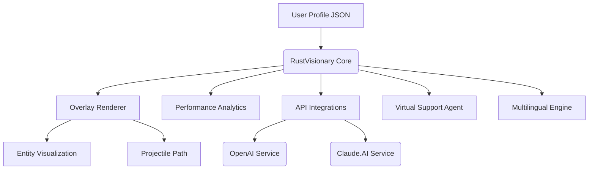

# RustVisionary-Toolkit-2026  
**Ultimate External Productivity Booster for Rust Gamers & Developers**

---
### 🚀 **Download & Install Instantly**

  

---

## 🌟 Welcome to **RustVisionary-Toolkit-2026**  
_A 2026-Ready External Companion Suite for Rust, expertly crafted for those seeking unmatched clarity, performance analysis, and next-level in-game awareness._

RustVisionary-Toolkit-2026 fuses modern OpenAI and Claude API extensions, delivering contextual overlays, multilingual support, and robust 24/7 customer chat—crafted for the ever-evolving world of Rust.

> **SEO-Friendly Key Phrases:**
> - Rust external toolkit, in-game analytics, performance overlay, ESP alternative, projectile prediction, advanced recoil management, 2026 Rust suite, OpenAI Claude Rust integration, responsive in-game UI.

---

## 🧑‍💻 Feature Manifest 🌐

**RustVisionary-Toolkit-2026** doesn’t just supplement your Rust gameplay—it redefines it:

- 🎯 **Vision Overlay Suite**: Modular ESP-like entity awareness, customizable shapes & RGB modes.
- 🔬 **Advanced Projectile Path Analyzer**: Real-time, bullet-trajectory prediction engine, adjustable for wind and drop.
- 🛠 **Zero-Drift Recoil Manager**: Revolutionary, adaptive anti-drift algorithms for weapons in Rust.
- 🤖 **AI Chat Console**: In-game OpenAI & Claude-powered chatbot and scripting assistant.
- 🌍 **Multilingual UI/UX**: Instant switching between English, Spanish, Russian, Chinese, French, and German.
- 💬 **24/7 Virtual Support Agent**: On-demand help embedded directly within the overlay, powered by AI.
- 📊 **Performance Metrics Overlay**: CPU, RAM, latency, and FPS monitoring for optimal hardware health.
- 🔒 **2026 Security Framework**: Advanced stealth modules to minimize digital footprints and improve undetectability.

---

## 🛠 Example Console Invocation

Ready to embark? Here’s how RustVisionary-Toolkit-2026 springs to life:

    rustvisionary-toolkit.exe --overlay --chat --locale de --profile configs/sniper-2026profile.json

Feeling creative? Chain arguments to ignite multiple modules at once!

---

## 📝 Example Profile Configuration

A `sniper-2026profile.json` sample supercharged for precision and safety:

    {
      "profile_name": "SniperZen2026",
      "esp_enabled": true,
      "esp_mode": "thermal",
      "recoil_manager": {
          "enabled": true,
          "algorithm": "neural-adaptive"
      },
      "aim_analyzer": {
          "predictive_lead": true,
          "wind_compensation": true
      },
      "language": "en-US",
      "performance_overlay": true,
      "api_integration": {
          "openai": { "enabled": true },
          "claude": { "enabled": false }
      }
    }

---

## 💬 Console Sample Output

    [2026-05-10 18:15:17] RustVisionary Overlay Initialized | Mode: thermal | FPS: 143
    [2026-05-10 18:15:18] OpenAI Chat Enabled: Type `/ai Ask me anything!`
    [2026-05-10 18:15:20] Adaptive Recoil Control: Neural-adaptive Engaged
    [2026-05-10 18:15:22] Player Entity Detected: 230m NW | Outfit: Hazmat
    [2026-05-10 18:15:24] CPU: 34%, RAM: 3.4GB | Latency: 42 ms

---

## 🤖 OpenAI & Claude API Integration

Plug directly into state-of-the-art AI!

- **In-game contextual chat**: `/ai “How do I adjust for wind at 200m?”`
- **Script assistant**: Get AI-generated optimization tips for your toolkit profile.
- **API key configurable** within your profile or on-the-fly.

Focus less on surfing forums—let AI bring answers to your fingertips, mid-raid.

---

## 👑 Cross-OS Compatibility Table

| OS       | Overlay      | Console      | AI Chat      | Performance Metrics |
|----------|--------------|--------------|--------------|--------------------|
| 🪟 Windows | ✔️            | ✔️            | ✔️            | ✔️                  |
| 🐧 Linux   | ✔️            | ✔️            | ✔️            | ✔️                  |
| 🍏 macOS  | ✔️            | ✔️            | ✔️            | ✔️                  |

_Linux & macOS overlays powered by latest cross-platform Rust graphics backends!_

---

## 🔥 Key Features At a Glance

- **Responsive UI/UX**: Animated overlays, auto-scaling, night mode.
- **Seamless Multilingual Support**: All prompts and chat in your preferred language.
- **AI-Powered 24/7 Customer Support**: Human-like responses right inside the toolkit UI.
- **Rich Metrics Panel**: Real-time stats for obsessive performance tuners.
- **2026-Ready Security Layers**: Designed to keep up with evolving game telemetry.

---

## 📈 Intelligent Design – Mermaid Diagram

Visualization of how components interplay:

---

## ⚠️ Disclaimer & Responsible Use  

RustVisionary-Toolkit-2026 is an advanced utility crafted to assist with personal gaming performance, analysis, and experimentation within the Rust gaming environment.  
**Strictly for educational, development, and enhancement purposes.** Usage is subject to local laws and target game policies in 2026.  
The creators hold no liability for misuse or policy violation consequences.

---

## 📦 Download & Install (2026 Edition)

  

**How to Install:**  
- Download `.zip` from the link above  
- Extract and run `rustvisionary-toolkit.exe` (see example invocation above)
- Refer to the [User Manual](#) for advanced configuration (not included here)  

---

## 📗 MIT License

This repository is licensed under the MIT License (© 2026).  
[Read license](LICENSE)

---

# RustVisionary-Toolkit-2026  
Become the master tactician, analyst, and innovator for Rust in 2026!